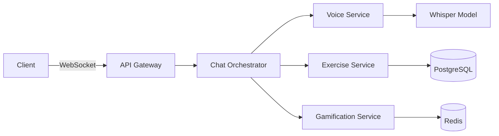

# Architect Agent: Technical Implementation Analysis

## Current Task: Design WebSocket Architecture for Real-time Features

### Technical Decision: WebSocket vs REST

**Decision: Hybrid Approach**
- WebSocket for real-time chat and voice streaming
- REST for CRUD operations and authentication

### WebSocket Event Architecture

```python
# WebSocket Events Design
class WebSocketEvents:
    # Client -> Server
    CLIENT_SEND_MESSAGE = "client:send_message"
    CLIENT_VOICE_CHUNK = "client:voice_chunk"
    CLIENT_EXERCISE_LOG = "client:exercise_log"
    
    # Server -> Client
    SERVER_MESSAGE = "server:message"
    SERVER_TRANSCRIPTION = "server:transcription"
    SERVER_UI_COMPONENT = "server:ui_component"
    SERVER_ACHIEVEMENT = "server:achievement"
```

### Microservices Breakdown

```yaml
services:
  voice_service:
    responsibility: Hebrew voice processing
    technology: Python + Whisper
    scaling: Horizontal with load balancer
    
  exercise_service:
    responsibility: Workout tracking & stats
    technology: FastAPI + PostgreSQL
    scaling: Read replicas for queries
    
  gamification_service:
    responsibility: Points, achievements, challenges
    technology: Redis + Background workers
    scaling: Redis cluster
    
  chat_orchestrator:
    responsibility: Message routing & UI generation
    technology: FastAPI + WebSocket
    scaling: Sticky sessions
```

### Data Flow Architecture



### Performance Optimization Strategy

1. **Model Caching**
   - Singleton pattern for Whisper model
   - Warm model on startup
   - Memory-mapped model files

2. **Database Optimization**
   - Connection pooling (20 connections)
   - Prepared statements
   - Indexed queries on common paths

3. **WebSocket Optimization**
   - Binary protocol for audio
   - Message batching
   - Compression (permessage-deflate)

### Security Architecture

```yaml
authentication:
  type: JWT
  expiry: 7 days
  refresh: Rolling refresh tokens
  
authorization:
  model: RBAC
  roles: [user, premium, admin]
  
data_protection:
  encryption_at_rest: AES-256
  encryption_in_transit: TLS 1.3
  voice_data: Ephemeral (not stored)
```

### Deployment Architecture

```yaml
production:
  orchestration: Docker Swarm / K8s
  load_balancer: Nginx
  ssl: Let's Encrypt
  monitoring: Prometheus + Grafana
  logging: ELK Stack
  
development:
  tool: Docker Compose
  hot_reload: Enabled
  debug: Remote debugging enabled
```

### API Contract Example

```typescript
// WebSocket Message Types
interface VoiceMessage {
  type: 'voice';
  data: {
    audio: ArrayBuffer;
    sampleRate: number;
    language: 'he' | 'en';
  };
}

interface ExerciseLogMessage {
  type: 'exercise_log';
  data: {
    exercise: string;
    reps?: number;
    weight?: number;
    duration?: number;
  };
}

interface ServerResponse {
  type: 'confirmation' | 'error' | 'ui_component';
  data: any;
  timestamp: string;
}
```

## Handoff to Development
Architecture is defined and ready for implementation. Key files to create:
1. `docker-compose.yml` - Service orchestration
2. `backend/app/websocket/` - WebSocket handlers
3. `frontend/src/hooks/useWebSocket.ts` - Client connection
4. `backend/app/services/` - Microservice implementations