# AI Fitness and Nutrition Bot UI/UX Specification

## Introduction
This document defines the user experience goals, flows, and visual design specifications for the bot's user interface, based on the approved PRD.

## Overall UX Goals & Principles
* **Clarity over cleverness:** Prioritize clear communication and intuitive interactions.
* **Progressive disclosure:** Show only what's needed, when it's needed. Generate UI elements contextually.
* **Immediate feedback:** Every user action should have a clear and immediate system response.
* **Accessible by default:** Design for all users from the start, targeting WCAG 2.1 AA.

## Information Architecture (IA)

The application is chat-first, so the IA is simple and revolves around the main chat view, with other views generated on demand.


## User Flows

### Flow: Logging a Workout

**User Goal:** To quickly and easily log the results of a completed exercise.

**Entry Point:** The main chat view.

**Success Criteria:** The user receives a confirmation that their workout was logged within seconds of sending the message.

```mermaid
sequenceDiagram
    participant User
    participant Frontend
    participant Backend
    User->>Frontend: Types or says "עשיתי 20 סקוואטים"
    Frontend->>Backend: Sends message via WebSocket
    Backend->>Backend: Parses message to extract exercise and data
    Backend->>Backend: Saves performance data to PostgreSQL
    Backend-->>Frontend: Sends confirmation message "אימון נשמר!"
    Frontend-->>User: Displays confirmation in chat
```



### Flow: Voice Input


## Wireframes & Component Specifications

### Main Chat View
```
┌─────────────────────────────────────┐
│  SweatBot 💪                    ⚙️  │
├─────────────────────────────────────┤
│                                     │
│  🤖 שלום! מה נעשה היום?            │
│                                     │
│  👤 עשיתי 20 סקוואטים               │
│                                     │
│  🤖 מעולה! 20 סקוואטים נשמרו      │
│     זה שיא אישי חדש! 🎉            │
│                                     │
│  👤 [Voice wave animation]          │
│                                     │
│                                     │
├─────────────────────────────────────┤
│  [טקסט...]                    🎤 📤 │
└─────────────────────────────────────┘
```

### Workout Statistics View (Generated)
```
┌─────────────────────────────────────┐
│  📊 הסטטיסטיקה שלך                  │
├─────────────────────────────────────┤
│                                     │
│  השבוע:                             │
│  ┌─────────────────────────┐       │
│  │ ████ ███ ████ ██ ███    │       │
│  │ ש  ר  ש  ח  ש  ש  א     │       │
│  └─────────────────────────┘       │
│                                     │
│  שיאים אישיים:                      │
│  • סקוואט: 20 חזרות (היום!)        │
│  • משיכות: 15 חזרות                │
│  • ריצה: 5 ק"מ ב-25 דקות          │
│                                     │
│  רצף: 🔥 7 ימים                    │
│                                     │
└─────────────────────────────────────┘
```

## Visual Design

### Color Palette
* **Primary:** #007BFF (Blue) - For interactive elements
* **Secondary:** #6C757D (Gray) - For secondary text
* **Background:** #FFFFFF (White) / #121212 (Dark Mode)
* **Success:** #28A745 (Green) - For confirmations and achievements
* **Accent:** #FFC107 (Amber) - For streaks and gamification highlights
* **Error:** #DC3545 (Red) - For errors and warnings

### Typography
* **Primary Font:** System UI (San Francisco, Segoe UI, Roboto)
* **Hebrew Font:** Assistant, Rubik (fallback)
* **H1:** 24px, Bold
* **H2:** 20px, Semi-bold
* **Body:** 16px, Regular
* **Small:** 14px, Regular

### Component Library

#### Button States
```css
/* Primary Button */
.btn-primary {
  background: #007BFF;
  color: white;
  border-radius: 8px;
  padding: 12px 24px;
  font-weight: 600;
}

.btn-primary:hover {
  background: #0056b3;
}

.btn-primary:disabled {
  opacity: 0.5;
  cursor: not-allowed;
}
```

#### Voice Recording Button
```css
.voice-btn {
  width: 48px;
  height: 48px;
  border-radius: 50%;
  background: #007BFF;
  animation: pulse 2s infinite;
}

.voice-btn.recording {
  background: #DC3545;
  animation: recording-pulse 1s infinite;
}
```

### Responsiveness Strategy

The application will be mobile-first and fully responsive:

#### Breakpoints
* **Mobile:** < 768px (single column)
* **Tablet:** 768px - 1024px (expandable panels)
* **Desktop:** > 1024px (multi-column with sidebar)

#### Mobile Adaptations
* Larger touch targets (minimum 44x44px)
* Bottom-aligned input area
* Swipe gestures for navigation
* Collapsible statistics panels

## Accessibility Requirements

### WCAG 2.1 AA Compliance
* **Color Contrast:** Minimum 4.5:1 for normal text, 3:1 for large text
* **Keyboard Navigation:** All interactive elements accessible via keyboard
* **Screen Reader Support:** Proper ARIA labels and roles
* **Focus Indicators:** Clear visual focus states

### Hebrew-Specific Considerations
* **RTL Layout:** Proper right-to-left text direction
* **Bi-directional Text:** Correct handling of mixed Hebrew/English
* **Font Size:** Larger default size for Hebrew characters

## Interaction Patterns

### Chat Input
* Auto-grow text area (max 4 lines)
* Send on Enter (Shift+Enter for new line)
* Typing indicator when bot is processing
* Message status indicators (sent, delivered, read)

### Voice Input
* Press and hold to record
* Visual feedback (waveform animation)
* Auto-stop after 30 seconds
* Cancel gesture (swipe away)

### Feedback Mechanisms
* **Success:** Green checkmark animation + haptic feedback
* **Error:** Red shake animation + error message
* **Loading:** Skeleton screens for generated UI
* **Achievement:** Confetti animation + sound effect

## Motion & Animation

### Principles
* **Purposeful:** Animations guide attention and provide feedback
* **Quick:** Most animations under 300ms
* **Smooth:** 60fps target, use GPU acceleration

### Key Animations
```css
@keyframes message-in {
  from {
    opacity: 0;
    transform: translateY(20px);
  }
  to {
    opacity: 1;
    transform: translateY(0);
  }
}

@keyframes recording-pulse {
  0%, 100% {
    box-shadow: 0 0 0 0 rgba(220, 53, 69, 0.4);
  }
  50% {
    box-shadow: 0 0 0 20px rgba(220, 53, 69, 0);
  }
}
```

## Dark Mode Specifications

### Color Adjustments
* Background: #121212
* Surface: #1E1E1E
* Primary Text: #E0E0E0
* Secondary Text: #A0A0A0
* Maintain brand colors but adjust brightness

### Implementation
* System preference detection
* Manual toggle in settings
* Smooth transition (300ms)
* Persistent user preference

## Performance Considerations

### Optimization Targets
* **First Contentful Paint:** < 1.5s
* **Time to Interactive:** < 3.5s
* **Largest Contentful Paint:** < 2.5s
* **Cumulative Layout Shift:** < 0.1

### Strategies
* Code splitting for on-demand UI components
* Image lazy loading
* Virtual scrolling for long chat histories
* Service Worker for offline capability
* WebSocket connection pooling

## Component States

### Message States
1. **Sending:** Opacity 0.7, loading indicator
2. **Sent:** Full opacity, single checkmark
3. **Delivered:** Double checkmark
4. **Error:** Red background, retry button

### Input States
1. **Default:** Normal border
2. **Focus:** Blue border, slight shadow
3. **Error:** Red border, error message below
4. **Disabled:** Gray background, reduced opacity

## Next Steps
* Create high-fidelity mockups in Figma
* Develop component library in Storybook
* Conduct usability testing with Hebrew speakers
* Implement A/B testing framework